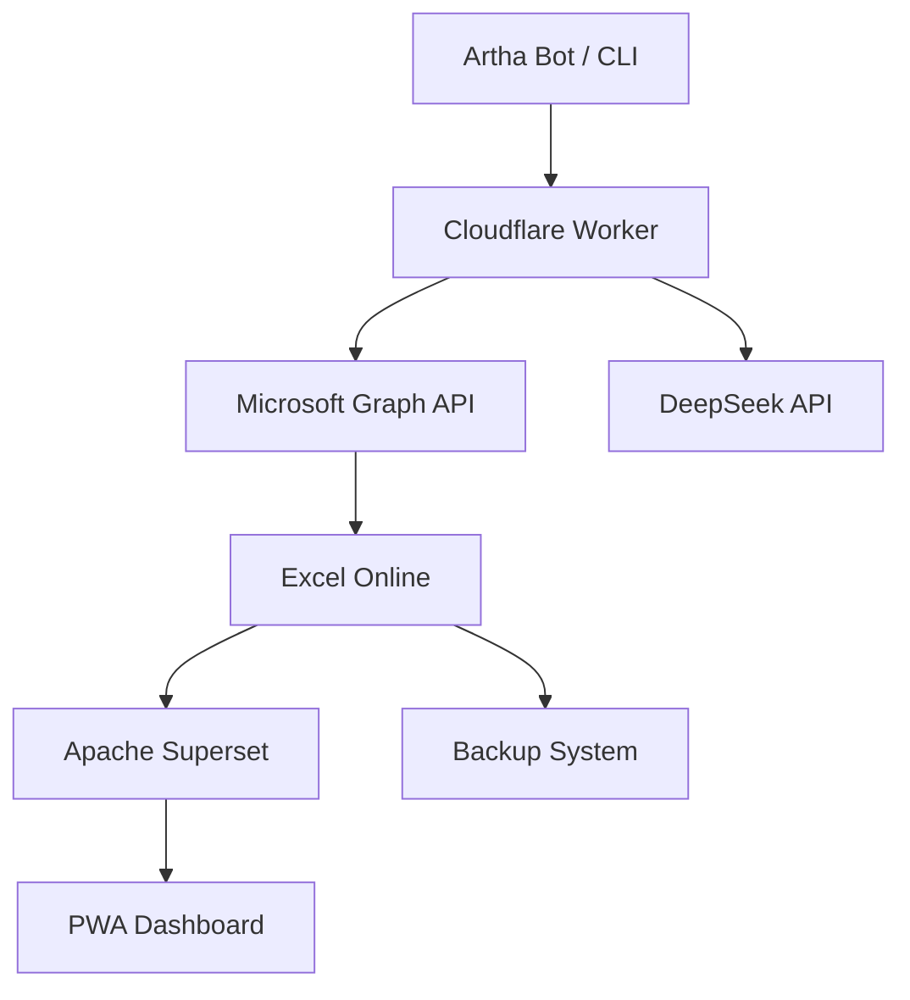

# 🌟 Artha: Personal Finance Command Center

A focused, AI-powered personal finance system built with native data control, automation, and zero recurring cost. Now simplified to use English-only interfaces for clarity, maintainability, and developer ease.

---

## 📊 Overview

**Artha** is a next-generation personal finance system that combines:

* 🌍 English-first UX (CLI, Telegram, PWA)
* 🧪 Excel-based backend (OneDrive)
* 🔧 CLI and Telegram-based data entry
* 🤖 DeepSeek AI for intelligent suggestions
* 🏦 Apache Superset for dashboards
* ⛨️ Enterprise-grade security via Azure AD

---

## 🔍 Architecture



### Key Technologies

| Layer         | Stack                    |
| ------------- | ------------------------ |
| Frontend      | React PWA, Telegram, CLI |
| Backend       | Cloudflare Workers       |
| DB Layer      | Excel (OneDrive)         |
| AI Engine     | DeepSeek API             |
| Visualization | Apache Superset          |
| Security      | Azure AD + OAuth + TLS   |

---

## 🔬 Modules

| Code             | Display Name       |
| ---------------- | ------------------ |
| `wealth`         | Wealth             |
| `vehicles`       | Vehicles           |
| `gold`           | Gold Investments   |
| `emergency_fund` | Emergency Fund     |
| `transactions`   | Transactions       |
| `goals`          | Goals              |
| `dashboard`      | Dashboard          |
| `insights`       | AI Recommendations |

---

## 🌐 Command Schema (English only)

| Command        | Handler           |
| -------------- | ----------------- |
| `/add_vehicle` | `update_vehicles` |
| `/add_gold`    | `update_gold`     |
| `/net_worth`   | `report_wealth`   |

---

## 📅 Data Model Examples

### Sheet: `vehicles`

| Vehicle | Last ODO | Cost/km | Tire PSI | Notes       |
| ------- | -------- | ------- | -------- | ----------- |
| Shine   | 42300    | ₹1.38   | 32/34    | Tire change |

### Sheet: `wealth`

| Asset Type   | Current Value | Growth % |
| ------------ | ------------- | -------- |
| Mutual Funds | ₹350,000      | 12.5%    |

---

## 🧐 AI Prompt Registry (DeepSeek)

### Prompt Template: `emi_optimization`

```json
{
  "template": "Given user's loan portfolio: {loans_table}\n\nCurrent market rates: {market_rates}\n\nGenerate 3 optimization recommendations with calculations, timeline, and suggested actions.",
  "version": "1.2",
  "style": "detailed_justification",
  "language": "english"
}
```

---

## 🛡️ Security Architecture

* Azure AD: App registration + OAuth 2.0
* Role: Only specific user IDs can edit/write
* Sheet protection: No overwrite of backup tables
* TLS 1.3 enforced end-to-end

---

## 🌐 Getting Started

```bash
# Clone
$ git clone https://github.com/artha-finance/core

# Configure
$ artha-cli config set default_language english

# Deploy
$ artha-cli deploy --modules all
```

---

## 📉 Monitoring

* CLI: `artha-cli limits`, `artha-cli errors`, `artha-cli prompts`
* Superset: Dashboard metrics (retry %, AI usage)
* Logs: Activity sheet `activity_log` with timestamps, command, status

---

## 🌟 Final Notes

> Artha now operates in its leanest, most powerful form—English-only, AI-augmented, and fully under your control.

* Designed for S22 Ultra, Ubuntu, Windows, and more
* Lightweight CLI + Telegram interface
* Bilingual extensibility can be reintroduced via `/lang/` module if needed

[View Docs](https://docs.artha.finance) | [Download Excel Template](https://artha.finance/templates/core_v1.0.xlsx) | [CLI Docs](https://docs.artha.finance/cli)
